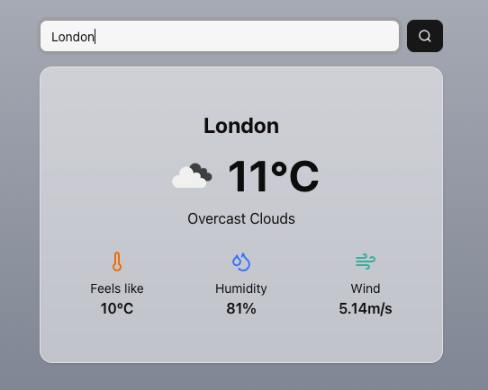

# WeatherApp



## Getting Started
First, install all of the neccessary packages:

```bash
npm i
```

Second, run the development server:

```bash
npm run dev
```

Open [http://localhost:3000](http://localhost:3000) with your browser to see the result.

## Architecture

The App has been created using the Next.js template with TypeScript, Tailwind, Shadcn, Zod and OpenWeatherAPI

## Reasoning

Next.js provided the best template for me to get started initially, with the installations of Tailwind and more being available. 

Shadcn allowed me to use custom built components, such as the Button, Card and Input components.

Zod allowed me to use the incoming data from OpenWeatherAPI and convert it into a schema.

## Improvements

1. Improving the forecasting ability, currently it shows the days forecast - I would like to implement it to show a weeks forecast.
2. Testing - currently there are no unit tests involved, as the app becomes more complex ensuring these tests are in place will become vital.
3. UI - As stated previously, the app currently shows the day's weather and the UI would need to be updated to showcase a forecast.
